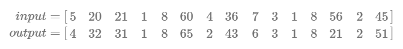

### Machine Translation

To use a neural network for machine translation, we build a network that takes as input a vector of integer word tokens from the source dictionary and outputs a vector of word tokens from the target dictionary. Each vector represents a sentence. The source and target dictionaries can be different sizes.

For example:

Around the neural network we need some additional components. On the input side, take the sentence string and produce the vector of word tokens. On the output side, convert the vector of word tokens to a sentence string.

To get the input word tokens, build a tokenizer for the source language, e.g. English, that splits a sentence into words and assigns a unique integer value to each word in the vocabulary. For example, if the vocabulary has 10,000 unique words in it, the tokenizer assigns an integer in the range 1-10,000. The token 0 is typically reserved for zero-padding the sequences, and there may be other special tokens as well.

We need a tokenizer for the output as well, but in the target language, e.g. French. But we run this one as a de-tokenizer. The output tokens are converted back into word strings and those word strings are concatenated to form the translated sentence.

Word embeddings make all the difference
Using a word embedding layer in the neural network increases the performance of the network.

Inputting word tokens directly into a neural network works, but not very well. The reason is that the integer tokens don’t have a natural ordering like, say, housing prices. The word “mountain” with integer token 7657 is not greater than “drive” with token 2332 in any sense.

The next logical thing to do is use one-hot encodings of the work tokens, e.g. [0 0 0 0 1 … 0 0 0 ]. But with tens or hundreds of thousands of words in the vocabulary, the weight matrix for a one-hot encoded input layer become very large and, since most of the matrix values are zero, very inefficient to compute with.

Best practice is to use a word embedding. A word embedding maps a word token to a “dense” vector with typically 100-300 dimensions. It effectively replaces the one-hot encoding vector with one of fewer dimensions, hundreds instead of tens or hundreds of thousands.

In practice, the integer word token is fed to the network and used to look up the corresponding embedding vector, and that embedding vector is fed into subsequent layers of the neural network.

The word embeddings can be learned along with the rest of the neural network model, or a pre-trained set of embeddings can be used. In the machine translation project, the word embeddings were learned during training. A vector of length 128 was chosen and performed well.

Output is only a prediction for the next word in the sentence
The neural network for machine translation has a fully-connected softmax output layer with one neuron for each word in the target vocabulary. The output vector is interpreted as a probability distribution across the vocabulary words.

There’s an additional step in the pipeline, after the neural network, that finds the word with the highest probability and coverts that word (token) into a text string. This is done by computing the argmax of the neural network output vector to get a word token, then using the target language tokenizer to look up the word for that token.

Sequence-to-sequence neural network models
The neural network model I built for machine translation is called a sequence-to-sequence model because it takes as input a sequence of words in one language (English) and outputs a sequence of words in another language (French). The sequence of words corresponds to a sentence.

Note that this type of architecture differs from, say, a classifier neural network which operates on one input vector at a time. Since each input is assumed to be independent of the others, the network makes a decision (prediction) for each input separately.

Could you build a neural network for machine translation that takes one word as input and outputs the translated word? Sure, but you won’t get a natural sounding translation. And, anyway, you don’t need a neural network for that. A dictionary look-up would work just fine.

Encoder-decoder neural network architecture
An encoder-decoder neural network architecture is best practice for many sequence-to-sequence problems. It consists of an encoder recurrent neural network followed by a decoder recurrent neural network. The encoder RNN takes the sequence of word tokens and encodes it into a fixed-length vector, the hidden state vector of the RNN. The decoder RNN is initialized with the state of the encoder RNN then run through a number of time steps to output the work tokens of the translated sentence. Those tokens are converted back into word strings and those word strings are concatenated to form the sentence.

